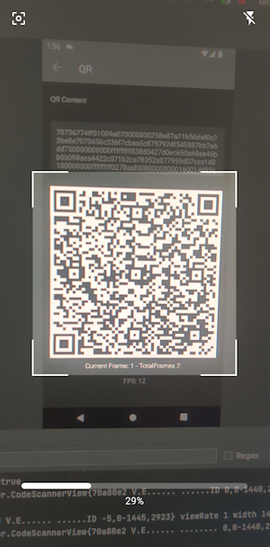

# Hummingbird-Android

### Android implementation of Uniform Resources (UR)
[](https://jitpack.io/#InvertedX/hummingbird-android)

<div style="text-align: center">
<table>
<tr>
  <td style="text-align: center">
     </a>
</td>
<td style="text-align: center">
 
 </td>
 </tr>
</table></div>

Hummingbird is a Java implementation of the [Uniform Resources (UR)](https://github.com/BlockchainCommons/Research/blob/master/papers/bcr-2020-005-ur.md) specification.
It is a direct port of the [URKit](https://github.com/BlockchainCommons/URKit) implementation by Wolf McNally.
It contains both the classes to represent a UR, and a UR encoder and decoder to encode and decode to/from the QR representations.
Hummingbird requires a minimum of Java 8.

## Setup

Hummingbird is hosted in Maven Central and can be added as a dependency with the following:

```
//UR Java library 
implementation('com.sparrowwallet:hummingbird:1.6.4')
 
// Add Jitpack  in project gradle 
 maven { url 'https://jitpack.io' }

//Android bindings for UR QR and Scanner
 implementation 'com.github.InvertedX:hummingbird-android:0.9'
```
## Scanner Usage
```
    <com.invertedx.hummingbird.QRScanner
        android:id="@+id/qrScanner"
        android:layout_width="match_parent"
        android:layout_height="match_parent"  />
```
### Listen to QR
```     
val scanner = findViewById<QRScanner>(R.id.qrScanner)
scanner.startScanner()
//Detects QR scans 
 scanner.setQRDecodeListener {
            scanner.stopScanner()
            MaterialAlertDialogBuilder(this@ScanActivity)
                .setTitle("QR Result")
                .setMessage(it)
                .setPositiveButton("Ok") { dialog, _ ->
                    dialog.dismiss()
                }.show()
        }
```
### Listen to UR QR scans
```
//Detects UR QR scans 
scanner.setURDecodeListener { result ->
    scanner.stopScanner()
     result.fold(
                onSuccess = {
                    //handle UR result
                }
                onFailure = {
                    // any scan failure 
                }
    )
}
```

## UR QR view usage


```
    <com.invertedx.hummingbird.URQRView
        android:id="@+id/urView"
        android:layout_width="360dp"
        android:layout_height="360dp"  />
        
  ```
create UR view referennce
 ```
  val urView = findViewById<URQRView>(R.id.urView)
 ```
set UR content
```
   urView.setContent(UR.fromBytes(hexToBytes(psbtHex)))
```
listen to UR transmission state
```
urView.setUrTransmissionListener { totalFrames, currentFrame ->
    urFrameStatus.text = "Current Frame: ${currentFrame} - TotalFrames ${totalFrames} \n\n FPS: ${urView.fps}"
}
```

[WIP:Flutter version](https://github.com/InvertedX/hummingbird-flutter)
 